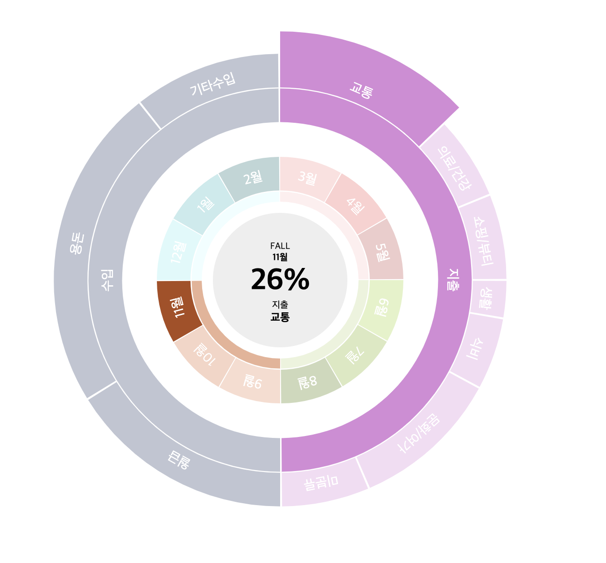

# Interactive Chart


📈 📉 push datas and make interactive chart 📊

## Demo

https://interactive-chart.vercel.app/

## Charts

|Line Chart `canvas`|Pie Chart `svg`|
|--|--|
|||
|drag / move / resize / minimap|hover & highlighting / information in circle|


## How to use

```bash
npm i interactive-chart
```

```js
// Line Chart
new Line({
  selector: "root", // DOM element id,
  chartTitle: "Accountbook Line Chart", // chart title
  data, // chart data
});

// Pie Chart
new Pie({
  selector: "root", // DOM element id,
  chartTitle: "Accountbook Line Chart", // chart title
  data, // chart data
  offsetMonth: 11 // current focusing month
});
```

```json
// data type
[
  {
    "month": 11,
    "data": [
      {
        "date": 1,
        "data": [
          { "type": "용돈", "amount": 3000 },
          { "type": "생활", "amount": -30000 },
          { "type": "쇼핑/뷰티", "amount": -10000 }
        ]
      },
      {
        "date": 2,
        "data": [
          { "type": "생활", "amount": -30000 },
          { "type": "식비", "amount": -50000 },
          { "type": "월급", "amount": 5000 }
        ]
      },
      ...
```
